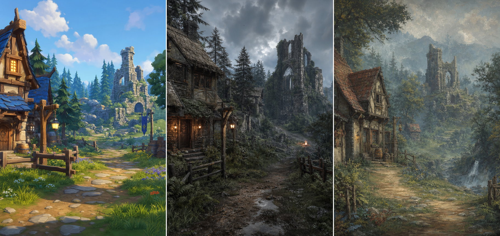

# Embermere RPG

**Embermere** is a classic high-fantasy RPG prototype inspired by the feeling of early EverQuest and World of Warcraft: tab targeting, hotbar combat, readable fantasy silhouettes, dangerous wilderness just outside town, and that old-school sense that a tiny village can open into a much bigger world.

This project is also a build journal. We are learning Unreal Engine 5.8 in public, using Codex and GPT-5.5 as a development partner, and experimenting with Unreal MCP as a way to let AI help drive editor workflows, scene building, iteration, and QA.



The current visual north star is the left side of this concept: **Stylized Classic** high fantasy with readable shapes, warm village light, chunky silhouettes, colorful wilderness, and a clear sense of where the adventure begins.

## The Game We Want To Build

The first playable slice is intentionally small:

- a shared starter zone called `L_Embermere_Prototype`
- a safe village hub with quest NPCs, vendors, and trainers
- a wilderness combat pocket with hostile starter enemies
- a small ruin landmark that gives the zone a reason to exist
- tab-target combat with nameplates, target frame, hotbar abilities, loot, XP, and quest progress

The long-term dream is a cozy-but-dangerous fantasy RPG that captures the social, exploratory, slightly mysterious feel of early online worlds while staying achievable for a small, AI-assisted build.

## The World Idea

Embermere begins at the edge of the known road: a lantern-lit village tucked against old woods, broken stone, marsh paths, and ruins that predate everyone living there. The first zone should feel friendly from the inn door and dangerous ten steps past the last fence.

The world tone we are chasing:

- classic high fantasy rather than grimdark
- inviting villages, readable roads, and landmarks you can navigate by memory
- wilderness that feels magical, old, and a little unsafe
- ruins that hint at deeper history without lore-dumping
- races and classes with strong silhouettes and tabletop-style identity
- combat that feels tactical and readable through tab targeting, hotbars, cooldowns, and clear enemy feedback

The starter zone is not meant to be huge. It is meant to be dense with promise: a place where one quest giver, one ruined tower, and a handful of hostile creatures can make the player feel like a bigger world is waiting.

## Current Prototype Foundation

The repo currently contains the C++ gameplay scaffold for:

- data-driven races, classes, and starter abilities
- Dwarf limited to Warrior/Cleric
- Bullywug limited to Warrior/Cleric/Ranger
- tab-target combat components
- classic MMO camera and mouse behavior
- `WASD` movement and `Q` autorun
- hotbar bindings for `1`, `2`, `3`, `4`, `Alt+R`, `Alt+E`, `R`, `X`, `E`, and `F`
- inventory, quest log, interactables, stats, combat, targeting, and hotbar components
- player/enemy character classes
- UMG base classes for character creation and HUD widgets
- native first-pass HUD panels for status, target, range state, quest tracking, dialogue, loot, and hotbar labels
- Unreal MCP setup notes and a local setup validator
- first editor-created Blueprints and rules data asset
- the saved starter-zone map `L_Embermere_Prototype`
- a greybox village, wilderness combat pocket, road, ruin landmark, PlayerStart, NPC placeholders, and starter enemy placements

## Starting Races

- Human
- Elf
- Dwarf
- Gnome
- Dark Elf
- Lizardman
- Ogre
- Bullywug

## Starting Classes

- **Warrior**: durable melee, threat, shield pressure
- **Cleric**: healing, smite, defensive blessings
- **Ranger**: bow/melee hybrid, snares, wilderness utility
- **Wizard**: roots, mana-heavy burst, arcane damage

## Asset Direction

The working visual north star is **Stylized Classic**: colorful high fantasy, readable silhouettes, lighter performance, and enough charm to avoid generic asset soup.

We are starting Unreal-first with Fab and Marketplace assets, then replacing or upgrading packs as the game identity sharpens. Gameplay systems are designed to stay asset-agnostic so art, VFX, icons, characters, and environments can be swapped without rewriting core mechanics.

See [Docs/ASSET_STRATEGY.md](Docs/ASSET_STRATEGY.md).

The current pack-by-pack shopping and import plan lives in [Docs/FAB_ASSET_PLAN.md](Docs/FAB_ASSET_PLAN.md).

## Unreal And MCP Setup

The project targets Unreal Engine 5.8 and includes plugin configuration for:

- `ModelContextProtocol` / Unreal MCP
- `AllToolsets`
- `PythonScriptPlugin`
- `EnhancedInput`

Setup notes live in [Docs/UNREAL_SETUP.md](Docs/UNREAL_SETUP.md).

After opening the project in Unreal, the intended MCP startup commands are:

```text
ModelContextProtocol.StartServer 8123
ModelContextProtocol.GenerateClientConfig Codex
```

Then validate locally:

```bash
zsh Scripts/check_unreal_setup.sh
```

## The Journey

This is not just a code repo. It is the record of building a fantasy RPG from zero Unreal experience into a playable prototype with modern AI-assisted development.

- [JOURNEY.md](JOURNEY.md) tracks decisions, milestones, and lessons.
- [TODO.md](TODO.md) keeps the daily next steps and automation handoff visible.
- [Docs/PLAYTESTING.md](Docs/PLAYTESTING.md) tracks the current editor smoke test.

## Status

Early Unreal prototype scaffold with MCP connected and the first starter-zone blockout saved.

Next milestone: improve selected-target/nameplate readability in the world, add inventory presentation, and begin the first Fab art replacement pass.
