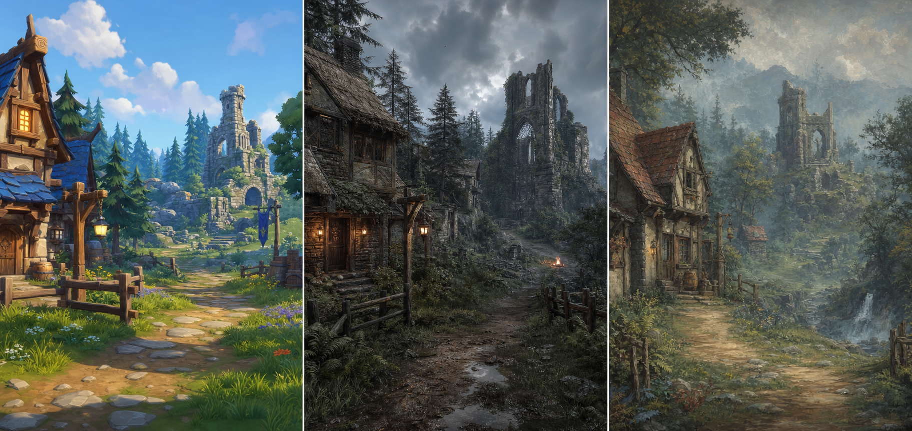

# Embermere RPG

**Embermere** is a classic high-fantasy RPG prototype inspired by the feeling of early EverQuest and World of Warcraft: tab targeting, hotbar combat, readable fantasy silhouettes, dangerous wilderness just outside town, and that old-school sense that a tiny village can open into a much bigger world.

This project is also a build journal. We are learning Unreal Engine 5.8 in public, using ChatGPT Codex as a development partner, and experimenting with Unreal MCP as a way to let AI help drive editor workflows, scene building, iteration, and QA.



The current visual north star is the left side of this concept: **Stylized Classic** high fantasy with readable shapes, warm village light, chunky silhouettes, colorful wilderness, and a clear sense of where the adventure begins.

## The Game We Want To Build

The first playable slice is intentionally small:

- a shared starter zone called `L_Embermere_Prototype`
- a safe village hub with quest NPCs, vendors, and trainers
- a wilderness combat pocket with hostile starter enemies
- a small ruin landmark that gives the zone a reason to exist
- tab-target combat with nameplates, target frame, hotbar abilities, loot, XP, and quest progress

The long-term dream is a cozy-but-dangerous fantasy RPG that captures the social, exploratory, slightly mysterious feel of early online worlds while staying achievable for a small, AI-assisted build.

## The World Idea

Embermere begins at the edge of the known road: a lantern-lit village tucked against old woods, broken stone, marsh paths, and ruins that predate everyone living there. The first zone should feel friendly from the inn door and dangerous ten steps past the last fence.

The world tone we are chasing:

- classic high fantasy rather than grimdark
- inviting villages, readable roads, and landmarks you can navigate by memory
- wilderness that feels magical, old, and a little unsafe
- ruins that hint at deeper history without lore-dumping
- races and classes with strong silhouettes and tabletop-style identity
- combat that feels tactical and readable through tab targeting, hotbars, cooldowns, and clear enemy feedback

The starter zone is not meant to be huge. It is meant to be dense with promise: a place where one quest giver, one ruined tower, and a handful of hostile creatures can make the player feel like a bigger world is waiting.

## Current Prototype Foundation

The repo currently contains the C++ gameplay scaffold for:

- data-driven races, classes, and starter abilities
- Dwarf limited to Warrior/Cleric
- Bullywug limited to Warrior/Cleric/Ranger
- tab-target combat components
- classic MMO camera and mouse behavior
- `WASD` movement and `Q` autorun
- hotbar bindings for `1`, `2`, `3`, `4`, `Alt+R`, `Alt+E`, `R`, `X`, `E`, and `F`
- inventory, equipment, quest log, interactables, stats, combat, targeting, and hotbar components
- player/enemy character classes
- an asset-agnostic NPC presentation wrapper with interchangeable static and
  skeletal visual lanes, shared authored transforms, soft art references, and
  no quest/service/interaction ownership
- a separate data-driven Fenwatch vendor service with player copper,
  finite/unlimited stock, complete buy/sell/buyback preflight, rollback-safe
  transactions, native fixed stock UI, inventory/chat feedback, and no art
  ownership
- data-driven item sell values plus an earned-currency loop: Mara's first quest
  grants copper exactly once, selected bag items can be sold by identity, and
  the latest sale can be bought back at its recorded price
- a versioned save-game contract for copper, XP, inventory/equipment identity,
  quest progress/completion, and finite vendor stock; loads resolve and
  validate the complete candidate before mutation, restore atomically, reject
  malformed records without partial state, and keep buyback session-only
- UMG base classes for character creation and HUD widgets
- native first-pass HUD panels for status, target, range state, quest tracking, dialogue, loot, and hotbar labels
- bottom-left chat/combat log for targeting, combat, quest, XP, inventory, and death/recovery feedback
- first hotbar cooldown enforcement and ready-time feedback
- starter enemy aggro, leash, return-home, attack, death, and respawn behavior
- player respawn with short damage protection plus a finite-world recovery
  plane that cancels autorun, freezes death movement, clears velocity, and
  restores walking at the village
- structured inventory/equipment window with clickable and draggable item rows, a fixed project-owned icon-bearing fantasy drag token, ten clickable/drop-target paper-doll slots over a data-driven illustrated adventurer backdrop, gold/red drop feedback, equipment-to-bag return, aggregate bonuses, cursor-aware game/UI input, capacity, selected-item effects, icon-bearing reward feedback, empty/reward states, `[`/`]` inspection cycling, `I` show/hide behavior, transactional Equip/Unequip, and consumable Use actions
- data-driven project-owned item and equipment-slot icons with explicit soft
  item references, category/missing-art fallbacks, fixed row/detail/slot sizes,
  deterministic source generation, and durable Unreal texture packages
- sixteen data-driven project-owned starter-ability icons plus an explicit
  fallback, fixed hotbar art cells, class-specific palettes, synchronized
  cooldown dimming, and accessible ability-stat tooltips
- functional data-driven starter utility effects: timed Attack Power and Armor
  buffs, six-second Snare, four-second Frost Root, Meditate mana recovery,
  effective-stat combat consumption, and respawn-safe effect clearing
- data-driven player and selected-target timed-status rows that reuse ability
  art, show live countdowns and hover descriptions, distinguish beneficial from
  harmful effects, refresh duplicate applications, and clear with the same
  expiration/respawn rules as gameplay
- eight-segment non-colliding world-status auras that subscribe to those same
  successful-effect snapshots; harmful auras ground to the supporting surface,
  scale from the creature footprint, distinguish marsh-green Snare from
  ice-white Frost Root, and remain presentation-only
- atomic inventory capacity and quantity operations with rollback-safe equipment replacement and full-bag unequip rejection
- idempotent equipment stat application for health, mana, armor mitigation, and power
- selected enemy UMG nameplate widget, HP bar/readout, and a bounds-aware
  cyan-blue 48-segment target circle that traces the supporting surface and
  uses a dedicated emissive Embermere material
- live hotbar cooldown countdowns with unavailable-state dimming
- Unreal MCP setup notes and a local setup validator
- first editor-created Blueprints and rules data asset
- a tracked level-1 Back-slot Recruit Pack quest reward for the first equipment action
- stackable Marsh Tonic recovery items dropped by Marsh Prowlers, connecting combat loot to the inventory `Use` action
- the saved starter-zone map `L_Embermere_Prototype`
- the first original rigged enemy, `SK_EmbermereMarshProwler_01`, with
  deterministic Blender source, 7,464 triangles, 26 authored bones, five
  swamp-fantasy materials, six imported animations, three validated saved
  instances, and asset-agnostic runtime presentation
- a corrected 57-actor local Fab/Epic art pass plus 17 placements from
  Embermere's original Blender-built waystone, ember-lamp, road-signpost,
  road-gate, boundary-fence, rune-topped boundary-stone, supply-chest, and
  Fenwatch shelter, Mara's Fenwatch keeper, the Fenwatch quartermaster, plus
  four visual-only marsh-reed clusters over the starter village, road,
  wilderness pocket, and ruin
  landmark, with grounded rotations,
  deliberate collision, a navigable PlayerStart/Mara route, a readable gate
  silhouette, a project-owned moss/earth/path material, collision-cleared solo
  enemy pulls, and a validated Mac-friendly daylight/atmosphere baseline

## Starting Races

- Human
- Elf
- Dwarf
- Gnome
- Dark Elf
- Lizardman
- Ogre
- Bullywug

## Starting Classes

- **Warrior**: durable melee, threat, shield pressure
- **Cleric**: healing, smite, defensive blessings
- **Ranger**: bow/melee hybrid, snares, wilderness utility
- **Wizard**: roots, mana-heavy burst, arcane damage

## Asset Direction

The working visual north star is **Stylized Classic**: colorful high fantasy, readable silhouettes, lighter performance, and enough charm to avoid generic asset soup.

We are starting Unreal-first with Fab and Marketplace assets, then replacing or upgrading packs as the game identity sharpens. Blender is our original-asset workshop for distinctive Embermere props, ruins, modular architecture, weapons, and eventually characters. Gameplay systems are designed to stay asset-agnostic so art, VFX, icons, characters, and environments can be swapped without rewriting core mechanics.

The public repository intentionally ignores raw Fab/Epic marketplace asset folders. The saved map can reference locally imported packs, but the source asset packs themselves should be installed through Fab/Epic Launcher on each development machine rather than redistributed through GitHub.

See [Docs/ASSET_STRATEGY.md](Docs/ASSET_STRATEGY.md).

The current pack-by-pack shopping and import plan lives in [Docs/FAB_ASSET_PLAN.md](Docs/FAB_ASSET_PLAN.md).

The original Blender and Blender MCP workflow lives in
[Docs/BLENDER_ASSET_PIPELINE.md](Docs/BLENDER_ASSET_PIPELINE.md). Its first
family now includes a project-owned stylized waystone shrine, matching ember
lamps, a timber road signpost, a traversable road gate, low boundary fences,
rune-topped end stones, a route-facing village supply chest, an open-sided
Fenwatch shelter, Mara's grounded Stylized Classic Fenwatch keeper,
the Fenwatch quartermaster, visual-only marsh reeds, and the fully rigged Marsh
Prowler, each built from reviewed scripts,
validated in Blender, imported through an explicit Unreal contract, and placed
as a swappable project-owned layer over the local Fab environment.

The reusable art-only static/skeletal NPC boundary lives in
[Docs/NPC_PRESENTATION_CONTRACT.md](Docs/NPC_PRESENTATION_CONTRACT.md).

## Unreal And MCP Setup

The project targets Unreal Engine 5.8 and includes plugin configuration for:

- `ModelContextProtocol` / Unreal MCP
- `AllToolsets`
- `PythonScriptPlugin`
- `EnhancedInput`

Setup notes live in [Docs/UNREAL_SETUP.md](Docs/UNREAL_SETUP.md).

Continuing from a fresh Codex task? Start with
[Docs/THREAD_HANDOFF.md](Docs/THREAD_HANDOFF.md), then follow the live priorities
in [TODO.md](TODO.md).

After opening the project in Unreal, the intended MCP startup commands are:

```text
ModelContextProtocol.StartServer 8123
ModelContextProtocol.GenerateClientConfig Codex
```

The generated client config remains a one-time setup step. For unattended or
daily starts, Unreal 5.8 can launch the listener with:

```text
-ModelContextProtocolStartServer -ModelContextProtocolPort=8123
```

On macOS, pass the project path after `--args` when launching through `open`;
see [Docs/UNREAL_SETUP.md](Docs/UNREAL_SETUP.md) for the exact command.

Then validate locally:

```bash
zsh Scripts/check_unreal_setup.sh
```

## The Journey

This is not just a code repo. It is the record of building a fantasy RPG from zero Unreal experience into a playable prototype with modern AI-assisted development.

- [JOURNEY.md](JOURNEY.md) tracks decisions, milestones, and lessons.
- [TODO.md](TODO.md) keeps the daily next steps and automation handoff visible.
- [Docs/PLAYTESTING.md](Docs/PLAYTESTING.md) tracks the current editor smoke test.
- [Docs/UNREAL_LESSONS.md](Docs/UNREAL_LESSONS.md) captures Unreal-specific lessons learned during implementation.
- [Docs/VENDOR_SERVICE_CONTRACT.md](Docs/VENDOR_SERVICE_CONTRACT.md) records
  the merchant art/service/economy boundary and transaction guarantees.
- [Docs/SAVE_GAME_CONTRACT.md](Docs/SAVE_GAME_CONTRACT.md) records the versioned
  progression schema, validation/rollback rules, session-only state, and live
  PIE verification lane.

## Status

Early playable Unreal prototype scaffold with Unreal and Blender MCP connected,
a daylight starter-zone loop mixing a local Fab pass with an original Embermere
waystone/lamp/signpost/gate/fence/end-stone/chest/shelter/keeper/
quartermaster/reed family, the first original rigged and animated Marsh
Prowler, grounded moss/earth road presentation,
collision-cleared solo-pull tab-target combat, a fully illustrated data-driven
starter hotbar with cooldown feedback, tooltips, timed buffs, root, snare, mana
recovery, live player/target status indicators, and restrained data-driven
world-status auras, native HUD panels,
bottom-left chat/combat feedback, first quest reward and starter-enemy loot
flow, a clickable and draggable illustrated paper-doll equipment/inventory
window with atomic transactions, project-owned data-driven art reused across
rows, slots, details, drag feedback, rewards, and the equipment backdrop, safe
consumable actions, native selected-target nameplate/emissive-ring feedback,
and a reusable static-to-skeletal NPC presentation contract demonstrated by
the grounded Fenwatch quartermaster beside the village supply chest. A
co-located art-free service now turns that quartermaster into Embermere's first
working merchant without coupling stock, prices, currency, transactions, or
interaction to the model. The playable loop now earns `20` copper from Mara's
first quest and supports rollback-safe selling and latest-item buyback through
the same fixed vendor panel. Explicit `EmbermereSave` and `EmbermereLoad`
prototype commands now persist the resulting copper, XP, exact item/equipment
identity, completed quest, and finite merchant stock across fresh PIE worlds;
the same file can be loaded repeatedly without duplicate rewards or bonuses.

Next milestone: add a small player-facing save/load menu and deliberate slot
lifecycle on top of the proven data contract, or prove the NPC wrapper's
skeletal/idle upgrade lane by adding a matching trainer presentation and
separate service. Autosave, multiple profiles, migrations, and position
persistence remain later product decisions.
